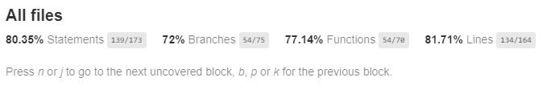

# Frontend Case study

## Kurulum

Aşağıdaki adımları tamamlayarak uygulamayı local ortamınızda ayağa kaldırabilirsiniz.

```bash
git clone https://github.com/mbozkaya/HB-case-study.git
```

```bash
cd /HB-case-study
```

```bash
npm install
```
```bash
npm start
```

artık [localhost:3000](http://localhost:3000)'i ziyaret edebilirsiniz.

## Canlı Örnek

[Buraya](https://xenodochial-mccarthy-fb05f8.netlify.app/)  tıklayarak canlı örneğe göz atabilirsiniz.

## Containerization

İsterseniz uygulamayı docker container üzerinde nginx configleriyle ayağa kaldırabilirsiniz.

Bunun için aşağıdaki 2 adımı takip edebilirsiniz.


```bash
npm run docker
```

```bash
npm run react-docker
```

## Test & Coverage

Testleri build etmek için 

```bash
 npm run test
```
coverage raporuyla build etmek için

```bash
 npm run test:cover
```

komutları kullanabilirsiniz.




## Product model

```json
{
    brand: "Apple"
    color: "Siyah"
    createdDate: Wed May 05 2021 00:00:00 GMT+0300 (GMT+03:00) {}
    discount: 13
    id: 5
    img: "images\black-product.png"
    netPrice: 90.85
    price: 149
    title: "Apple iPhone 11 Pro Maxi Phone 11 Pro Max iPhone 11 (Max 2 Line)..."
}
```
Ayrıca sepete eklenen verilerin eklenme zamanları basketDate olarak modele eklenmektedir.
